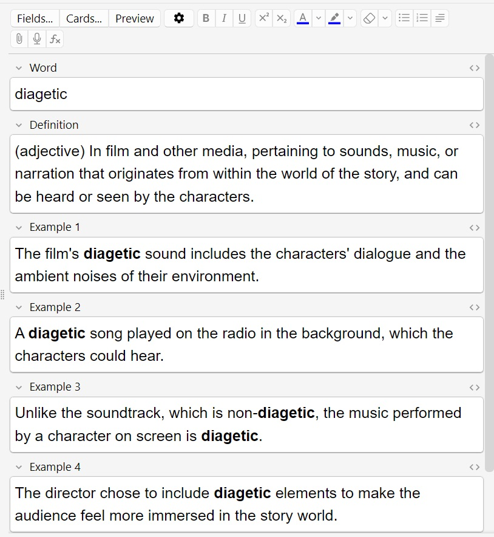

# AnkiHelper

AnkiHelper is a custom Chrome extension developed to streamline and automate the process of creating Anki flashcards. The extension facilitates the generation of word definitions along with examples and automatically creates a corresponding Anki flashcard with a single click. The automation pipeline behind this extension is built on the n8n platform.

## Screenshots

An example of a flashcard created using AnkiHelper:

